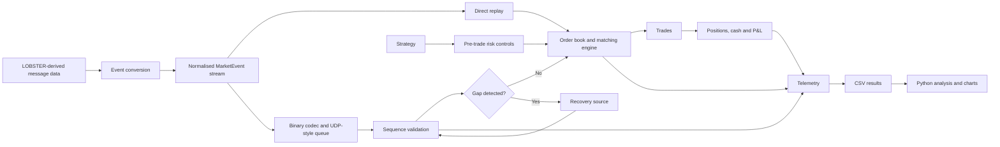
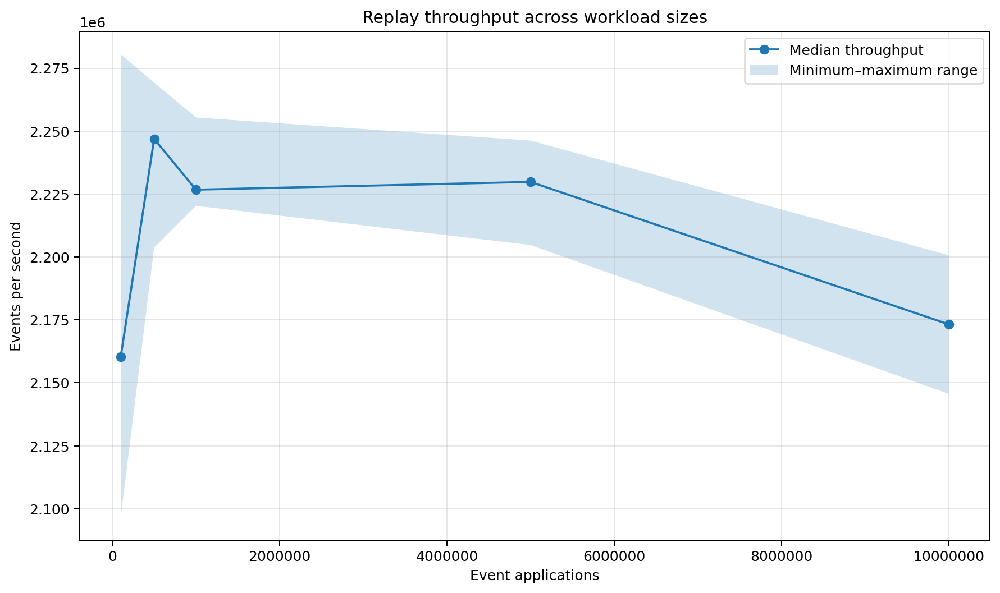
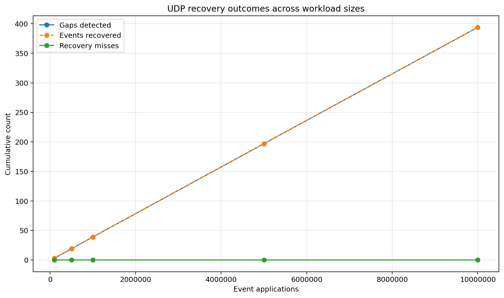

# Electronic Order Book

A **C++20 electronic trading-system simulator** built to test a harder question than “can an order book match orders correctly?”

This project evaluates whether a limit-order-book engine can remain **fast, internally consistent and operationally resilient** when subjected to realistic event-driven workloads, sequenced market-data handling, recovery from missing updates, strategy interaction, risk controls, position tracking, P&L accounting and telemetry-driven performance analysis.

Rather than stopping at a toy matching engine, the repository brings together the core components that sit around a trading engine in practice: **deterministic replay, binary message handling, UDP-style sequencing and recovery, market-making logic, pre-trade risk checks, participant-level P&L, and Python-based analysis of latency, throughput, memory and recovery behaviour**.

The system is evaluated on a **LOBSTER-derived event stream** and on **multi-million-event replay workloads**, so the emphasis is not just on implementation, but on demonstrating correctness, scalability and engineering judgement in a way that is relevant to **exchanges, banks, hedge funds, market makers and systematic trading teams**.

> **Start with the full report:**  
> [Read the performance, correctness and recovery report](docs/performance_report.md)
>
> The report explains the problem being solved, system design, validation methodology, LOBSTER conversion, risk and P&L workflow, direct-replay scalability, UDP fault injection, graph interpretation, limitations and next steps.
>
> Downloadable versions:
> [PDF](docs/electronic_order_book_performance_report.pdf) ·
> [Word](docs/electronic_order_book_performance_report.docx)

---

## Problem and objective

Electronic trading infrastructure must process large, ordered streams of market events without corrupting market state.

Raw speed is not enough. A system may continue processing while:

- an earlier market-data update is missing;
- order indexes and price levels have become inconsistent;
- price-time priority has been broken;
- a strategy has exceeded its permitted exposure;
- executed trades no longer reconcile with positions, cash or P&L.

The objective of this project is to build and validate a controlled electronic-trading infrastructure simulator that treats **performance, correctness and resilience as connected engineering requirements**.

The central question is:

> Can a C++20 order-book engine process large, stateful market-event workloads at stable latency while preserving matching rules, validating internal state, enforcing risk limits, maintaining positions and P&L, and recovering deterministically from missing sequenced updates?

---

## What this project does differently

**Real event-flow input**  
The engine is evaluated with **400,391 LOBSTER-derived AAPL source rows**, rather than relying only on hand-written tests or uniformly random synthetic orders.

**Performance and correctness measured together**  
The benchmark records runtime, throughput, sampled p50/p95/p99 latency and memory while also requiring zero rejected benchmark events and successful order-book invariant checks.

**Deliberate failure injection**  
The UDP benchmark intentionally removes sequenced updates, verifies that gaps are detected, recovers the missing events and checks that recovery misses remain at zero.

**Separate fast path and recovery path**  
Direct replay isolates normalised event-application performance. UDP scalability measures the additional cost of serialisation, queueing, decoding, sequence validation and recovery.

**Broader trading-system scope**  
The repository combines matching, deterministic replay, binary codecs, market-data recovery, strategy logic, risk controls, position/P&L processing, telemetry and Python analysis.

**Transparent data limitations**  
The project distinguishes a useful LOBSTER-derived event stream from a complete reconstruction of the original L3 market state. Missing order references and hidden executions are counted rather than silently fabricated.

---

## Key capabilities

- Price-time-priority limit-order matching
- FIFO execution within each price level
- Add, cancel, modify and execute operations
- Partial fills and multi-level matching
- Direct lookup through an order-ID index
- Structural order-book invariant validation
- Deterministic `MarketEvent` replay
- Binary serialisation, decoding and round-trip validation
- LOBSTER-derived event conversion
- Market-making strategy integration
- Configurable pre-trade risk controls
- Inventory, cash, realised P&L and unrealised P&L processing
- UDP-style packet sequencing and gap detection
- Deterministic missing-event recovery
- Structured CSV telemetry
- Python-generated performance and recovery charts
- Unit, integration, recovery and scalability tests

---

## Architecture overview



The benchmark deliberately separates the direct event-application path from the broader recovery pipeline. This makes the cost of resilience visible rather than hiding it inside one combined throughput number.

---

## Benchmark snapshot

The LOBSTER-derived converter processed:

| Metric | Count |
|---|---:|
| Source rows | 400,391 |
| Replayable converted events | 380,678 |
| Orders still active after conversion | 10,085 |
| Missing order references skipped | 8,381 |
| Hidden executions skipped | 11,332 |
| Control events ignored | 0 |

Direct replay was tested at **100,000, 500,000, 1 million, 5 million and 10 million event applications**, with **five repetitions per workload**.

### Development benchmark results

The current measurements were produced from a **Debug build on a general-purpose Windows environment**. They are useful development measurements, not production exchange-latency claims.

- **25 / 25** direct-replay runs passed
- **0** rejected benchmark events
- **0** order-book invariant failures
- Approximately **2.16–2.25 million direct event applications per second**
- Approximately **0.9–1.0 μs sampled p99 direct-event latency**
- Median peak working set increased from approximately **35.3 MB to 37.2 MB**
- Every deliberately omitted UDP event was recovered
- **0** recovery misses across the measured UDP workloads





The full methodology, all nine charts and detailed interpretation are available in the
[performance report](docs/performance_report.md).

---

## Validation methodology

The project uses layered validation rather than treating one successful benchmark as proof that every subsystem is correct.

1. **Matching correctness** — price priority, FIFO behaviour, quantity arithmetic, cancellations, modifications, partial fills and multi-fill execution.
2. **Replay correctness** — deterministic event parsing, binary serialisation and round-trip equality.
3. **Strategy and risk** — quote generation remains separate from order approval, and configured limits can reject unsafe actions.
4. **Position and P&L** — trades update participant inventory, cash, realised P&L, unrealised P&L and marked account value.
5. **Recovery correctness** — deliberately missing updates are detected and recovered, and the recovered final state is validated.
6. **Direct replay scalability** — normalised event application is measured independently of CSV parsing and telemetry output.
7. **UDP scalability** — serialisation, queueing, decoding, sequencing and recovery are measured as a broader resilience path.

See [docs/performance_report.md](docs/performance_report.md) for the exact test boundaries, workload construction and interpretation of each result.

---

## Project structure

```text
electronic-order-book/
├── README.md                         Project overview and entry point
├── CMakeLists.txt                    Build configuration
│
├── include/                          Public interfaces and shared types
├── src/                              Core engine implementations
├── tests/                            Unit and integration test suites
├── demos/                            Strategy, P&L, replay and recovery demos
├── benchmarks/                       Latency and scalability benchmark code
├── support/                          Shared scenarios and test utilities
│
├── analysis/
│   ├── plot_scalability.py           Direct and UDP scalability charts
│   └── ...                           Additional telemetry analysis scripts
│
├── data/
│   └── lobster/                      LOBSTER-derived source inputs
│
├── results/
│   ├── scalability/                  Raw benchmark CSV outputs
│   ├── lobster_charts/               Generated report figures
│   ├── matching_engine_telemetry/    Operation-level latency telemetry
│   ├── lobster_telemetry/            Reconstructed market-state telemetry
│   └── udp_recovery_telemetry/       Sequencing and recovery telemetry
│
└── docs/
    ├── performance_report.md         Main GitHub-readable technical report
    ├── electronic_order_book_performance_report.pdf
    └── electronic_order_book_performance_report.docx
```

### Documentation

| File | Purpose |
|---|---|
| [`README.md`](README.md) | Fast project overview, setup and navigation |
| [`docs/performance_report.md`](docs/performance_report.md) | Full methodology, results, graphs, interpretation and limitations |
| [`docs/electronic_order_book_performance_report.pdf`](docs/electronic_order_book_performance_report.pdf) | Fixed-layout downloadable report |
| [`docs/electronic_order_book_performance_report.docx`](docs/electronic_order_book_performance_report.docx) | Editable Word version of the report |
| [`results/scalability/`](results/scalability/) | Raw direct-replay and UDP benchmark results |
| [`results/lobster_charts/`](results/lobster_charts/) | Generated figures used by the report |

---

## Build

### Requirements

- CMake
- Ninja, MinGW Makefiles or Visual Studio
- A C++20-compatible compiler
- Python 3 with `pandas` and `matplotlib` for chart generation

### CLion / MinGW

Configure and build from the project root:

```bash
cmake -S . -B cmake-build-release -G Ninja -DCMAKE_BUILD_TYPE=Release
cmake --build cmake-build-release
```

### Visual Studio generator

```bash
cmake -S . -B build -G "Visual Studio 17 2022" -A x64
cmake --build build --config Release
```

---

## Run the test suite

For a single-configuration Ninja/MinGW build:

```bash
./cmake-build-release/engine_tests
```

For a Visual Studio multi-configuration build:

```bash
./build/Release/engine_tests.exe
```

The test suite covers matching, replay, strategy/risk, P&L and UDP recovery.

---

## Run the application and benchmarks

The exact executable path depends on the selected CMake generator.

### Run the complete demonstration workflow

```bash
./cmake-build-release/electronic_order_book
```

### Isolated matching-engine latency benchmark

```bash
./cmake-build-release/electronic_order_book --benchmark
```

### LOBSTER-derived direct replay scalability

```bash
./cmake-build-release/electronic_order_book --scalability
```

### Small UDP recovery demonstration

```bash
./cmake-build-release/electronic_order_book --udp-demo
```

### Full LOBSTER-derived UDP recovery test

```bash
./cmake-build-release/electronic_order_book --udp-full
```

### UDP scalability benchmark

```bash
./cmake-build-release/electronic_order_book --udp-scalability
```

On Windows Command Prompt or PowerShell, append `.exe` where required.

---

## Generate the charts

Install the Python dependencies:

```bash
python -m pip install pandas matplotlib
```

Run the scalability analysis:

```bash
python analysis/plot_scalability.py
```

Expected inputs:

```text
results/scalability/lobster_scalability.csv
results/scalability/udp_scalability.csv
```

Expected output directory:

```text
results/lobster_charts/
```

---

## Data and interpretation boundaries

The source interval does not contain every order required to reconstruct the complete original market state.

The converter therefore:

- skips messages that reference orders absent from the locally available starting state;
- skips hidden executions that cannot be linked to a visible resting order;
- reports all skipped-event counts explicitly.

The resulting stream is appropriate for:

- event-processing experiments;
- matching-engine correctness tests;
- deterministic replay;
- scalability evaluation;
- sequencing and recovery tests.

It should not be described as a complete original-market L3 reconstruction.

Workloads above 380,678 event applications reuse the converted source stream. The order book is reset between complete passes because order IDs repeat when the same stream is replayed.

---

## Technology

- C++20
- CMake
- Ninja / MinGW / MSVC
- Windows Winsock
- Python
- pandas
- matplotlib

---

## Current limitations

- The published figures were generated from a Debug build.
- CPU and RAM metadata were not captured with the current benchmark run.
- Direct replay excludes CSV parsing, disk I/O and external network transport.
- Direct event latency is sampled rather than measured for every operation.
- The UDP path is a controlled in-process simulation, not a production multicast/NIC test.
- The evaluation uses one AAPL-derived source interval.
- Risk and P&L are functionally validated but are outside the direct replay timed region.

These boundaries are documented so that the results remain precise and reproducible rather than being presented as unsupported production claims.

---

## Next steps

- Repeat the complete benchmark suite in Release mode
- Record CPU, RAM, compiler and operating-system metadata
- Increase repetitions and report confidence intervals
- Add operation-level add/cancel/modify/execute latency distributions
- Separate codec, queue, sequencing and recovery costs
- Test additional symbols and market periods
- Expand fuzzing, sanitiser and property-based testing
- Add richer portfolio-risk and multi-symbol P&L scenarios

---

## Report

For the complete technical evaluation, read:

### [Electronic Order Book Performance, Correctness and Recovery Report](docs/performance_report.md)

It includes:

- the full problem statement and project objective;
- what makes the project different from a basic order-book implementation;
- matching, replay, strategy, risk and P&L system scope;
- seven-stage validation methodology;
- LOBSTER conversion and reconstruction limitations;
- direct replay runtime, throughput, latency and memory analysis;
- UDP fault injection, recovery counts and recovery latency;
- all benchmark graphs with detailed trend interpretation;
- relevance to exchanges, banks, brokers and systematic funds;
- limitations and recommended engineering improvements.
