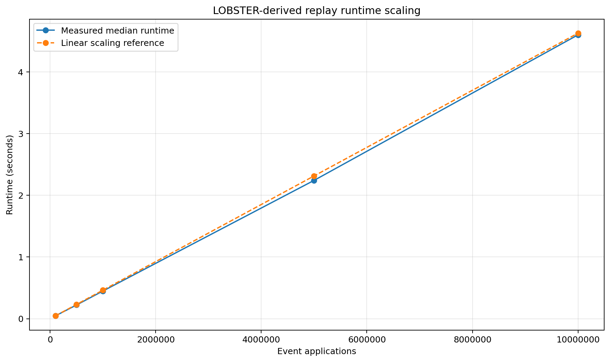
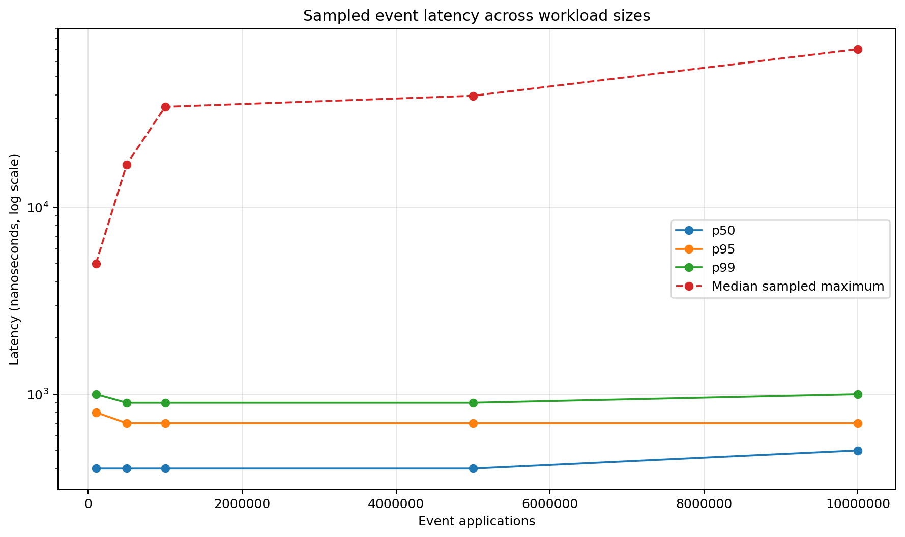
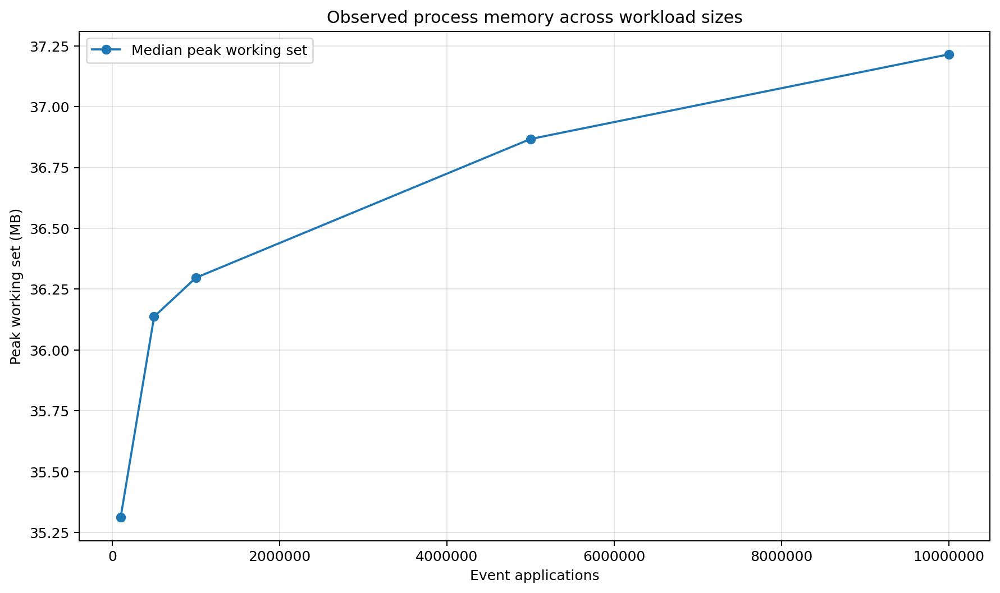
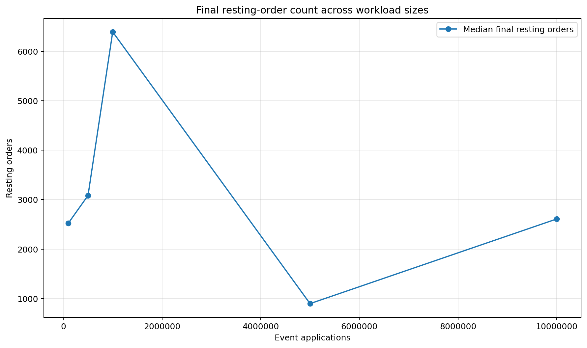
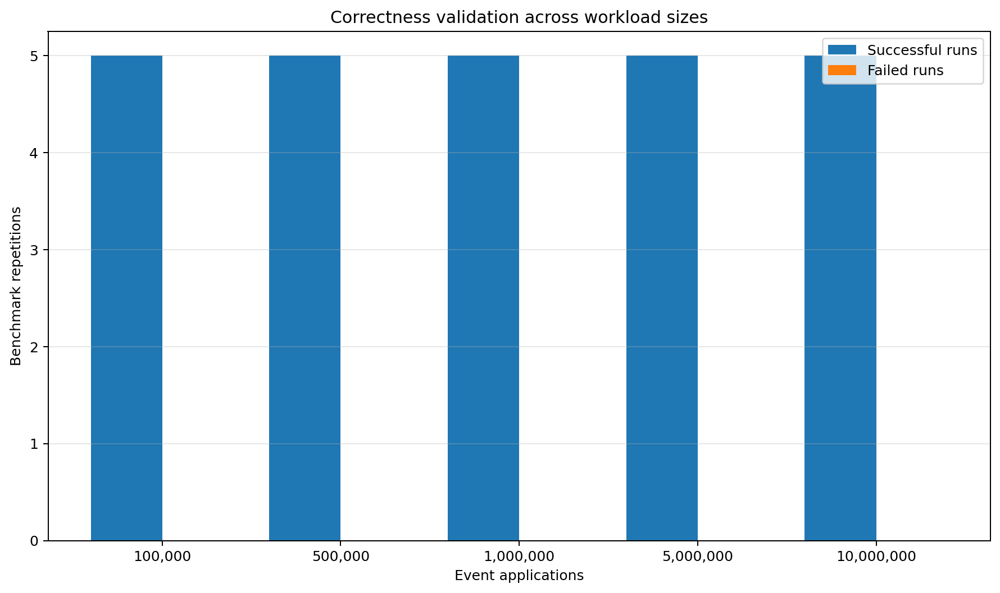
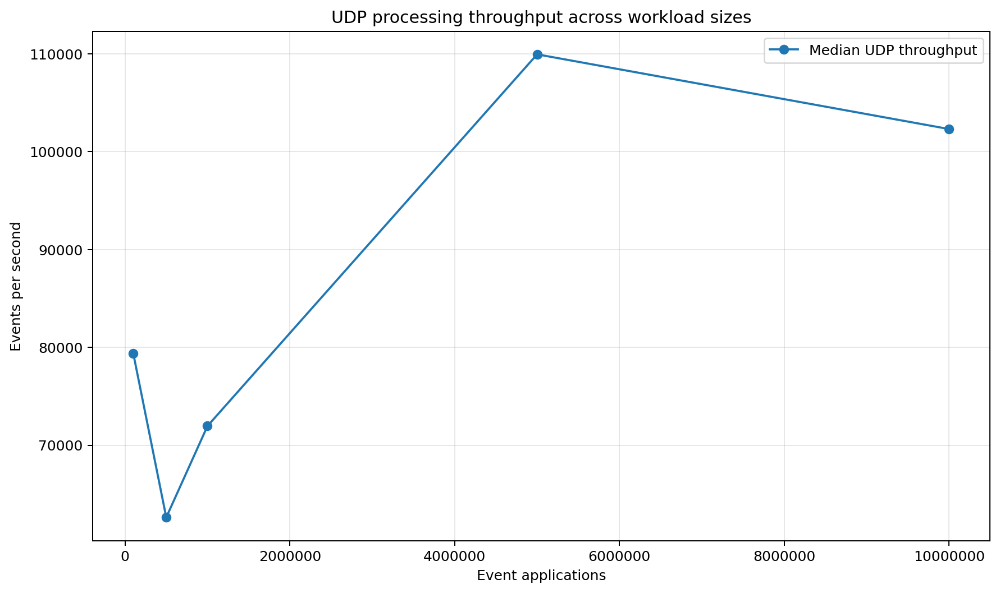
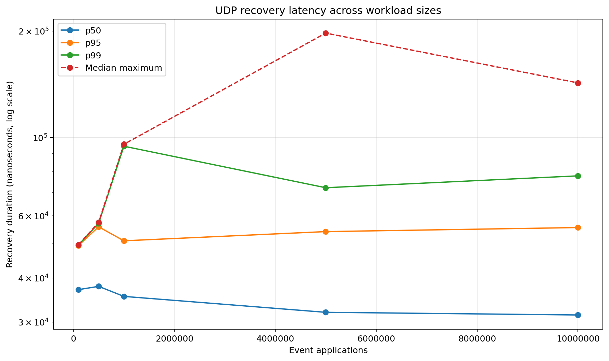

# Electronic Order Book Engineering Report

## Performance, correctness, risk, P&L and market-data recovery evaluation

## 1. Problem statement and objective

Electronic trading infrastructure must process large, ordered streams of market events while preserving an economically correct representation of the market. Raw speed alone is not sufficient: a system can continue processing while its order book is corrupted by a missed update, its order index diverges from queued state, a strategy exceeds its permitted exposure, or downstream cash, inventory and P&L no longer reconcile with executed trades.

The objective of this project is to design and validate a **modular C++20 electronic order-book and matching-engine simulator** that treats performance, correctness, financial controls and recovery as connected engineering requirements rather than separate demonstrations.

The system is evaluated through deterministic replay of **400,391 LOBSTER-derived AAPL source rows**. It combines price-time-priority matching with normalised event replay, binary event handling, market-making strategy integration, configurable pre-trade risk controls, position and P&L accounting, structured telemetry, and a sequenced UDP-style feed capable of detecting and recovering deliberately omitted updates.

The central engineering question is:

> Can the engine process large, stateful market-event workloads at stable latency while preserving price-time priority and order-book invariants, maintaining coherent risk and accounting state, and recovering to the same final state as a clean replay after market-data loss?

The project is best understood as a **small electronic-trading infrastructure stack**. It is not presented as a production exchange or as an end-to-end wire-latency claim; it is a controlled engineering platform for testing the interaction between performance, state integrity, financial controls and failure recovery.

### 1.1 What this project does differently

- **Real event-flow input:** The engine is evaluated with approximately 400,000 LOBSTER-derived source rows rather than relying only on hand-written or uniformly random synthetic orders.
- **Performance and correctness measured together:** The benchmark records runtime, throughput, sampled p50/p95/p99 latency and memory, while also requiring zero rejected events and successful order-book invariant checks.
- **Deliberate failure injection:** The UDP benchmark intentionally removes sequenced updates, verifies that gaps are detected, recovers the missing events and checks that recovery misses remain at zero.
- **Separate fast path and recovery path:** Direct replay isolates event-application performance, while UDP scalability measures the additional cost of serialisation, queueing, decoding, sequencing and recovery.
- **Broader trading-system scope:** The repository combines matching, deterministic replay, binary codecs, market-data recovery, risk controls, position/P&L processing, telemetry and Python analysis.
- **Transparent data limitations:** The report explicitly distinguishes a useful LOBSTER-derived event stream from a complete original-market L3 reconstruction.

### 1.2 Engineering depth behind these differences

#### Stateful market-data reconstruction rather than toy order generation

The engine is evaluated with **400,391 LOBSTER-derived AAPL source rows**. Converting this input requires more than feeding random orders into a container: the loader must interpret stateful add, cancel, delete and execution messages, track active order IDs, handle references to orders that are outside the locally available state, and deliberately separate visible from hidden execution flow.

#### Correctness-gated performance, not headline speed in isolation

A benchmark result is accepted only if the event stream is applied without rejected benchmark events and the reconstructed book passes structural invariant validation. Runtime, throughput, sampled p50/p95/p99 latency and memory are measured alongside correctness. This prevents a fast but corrupted order book from being treated as a successful run.

#### Fault injection with state recovery

The UDP path deliberately removes sequenced updates. The engine must detect the discontinuity, pause normal ordered application, retrieve the missing event from a recovery source, restore sequence continuity and return to a healthy state. In the full recovery test, the recovered final book is compared with a clean, loss-free replay so recovery is validated by **state equivalence**, not merely by logging that a gap occurred.

#### Separate measurement of the fast path and the resilient path

Direct replay isolates normalised event application inside the matching engine. UDP scalability measures the extra work introduced by serialisation, queueing, decoding, sequence validation, recovery and ordered resumption. This separation makes it possible to reason about the cost of resilience rather than mixing all overhead into one number.

#### Integrated trading-system responsibilities

The repository connects matching, replay, binary codecs, strategy logic, pre-trade risk controls, trade processing, inventory, P&L, telemetry and analysis. These components are tested separately where isolation matters and then exercised together in demos and recovery workflows. This is significantly broader than implementing add/cancel/match functions alone.

#### Measurement designed to avoid contaminating the timed path

Input events are loaded and converted before the direct replay timer starts. Telemetry writing and full invariant validation occur outside the measured event-application interval. Latency is sampled rather than timed on every event, and storage is reserved before timed loops where possible. These choices reduce the chance that the benchmark mostly measures logging, allocation or file I/O.

#### Transparent treatment of imperfect market data

The report does not hide the fact that the available interval cannot reproduce every original L3 order. Missing references and hidden executions are counted and excluded explicitly. The resulting stream is used for the claims it can support - event processing, correctness and scalability - without being misrepresented as a complete original-market reconstruction.

## 2. Executive findings

The direct replay benchmark used **380,678 converted events** derived from approximately 400,000 source rows. It tested 100,000, 500,000, 1 million, 5 million and 10 million event applications, with five repetitions at each workload.

- **25 of 25 direct-replay runs completed successfully.**
- **Zero benchmark events were rejected.**
- **All order-book invariant checks passed.**
- Median direct-replay throughput remained approximately **2.16-2.25 million events per second**.
- The median 10-million-event runtime was **4.601 seconds**.
- Sampled p99 direct-event latency remained approximately **0.9-1.0 microseconds**.
- Median peak working-set memory increased by only approximately **1.9 MB** between 100,000 and 10 million event applications.
- Every deliberately omitted UDP event was recovered, with **zero recovery misses** in the measured workloads.

| Workload | Median runtime | Median throughput | Median p99 | Median peak memory |
|---:|---:|---:|---:|---:|
| 100,000 | 0.046 s | 2,160,354 events/s | 1,000 ns | 35.312 MB |
| 500,000 | 0.223 s | 2,246,922 events/s | 900 ns | 36.137 MB |
| 1,000,000 | 0.449 s | 2,226,734 events/s | 900 ns | 36.297 MB |
| 5,000,000 | 2.242 s | 2,229,836 events/s | 900 ns | 36.867 MB |
| 10,000,000 | 4.601 s | 2,173,241 events/s | 1,000 ns | 37.215 MB |

## 3. System scope

### 3.1 Matching engine and order-book state

The core engine maintains independent bid and ask sides, ordered by economically correct price priority. Orders sharing a price level are processed in FIFO order. An order index supports direct lookup by order ID, while validation checks that the index, price levels and queued orders remain consistent after event application.

The matching tests cover order entry, cancellation, modification, aggressive execution, partial fills, multiple fills and removal of completed price levels. These tests establish functional correctness before performance measurements are considered.

### 3.2 Deterministic replay and binary event handling

Market-data messages are normalised into a common `MarketEvent` representation. The replay and codec layer supports deterministic serialisation, parsing and round-trip comparison. A binary event file must decode back to the same logical events; otherwise the replay path is rejected.

Determinism matters for financial systems because the same ordered input should reproduce the same engine state during backtesting, incident investigation and audit.

### 3.3 Strategy and risk controls

The project includes a market-making strategy that observes the current market state and attempts to refresh bid and ask quotes. Quote generation is not allowed to bypass the configured risk layer. Strategy and risk tests exercise the interaction between quoting decisions, current inventory and configured order/risk constraints.

This component demonstrates that order generation and order acceptance are separate responsibilities: a strategy can propose an order, while risk logic decides whether that action is permitted.

### 3.4 Position and P&L processing

Generated trades are consumed by a P&L engine that maintains account cash, positions and valuation state. The workflow processes new fills, updates inventory, marks positions from the current book and produces a summary report.

The P&L tests validate accounting behaviour independently from the latency benchmark. Keeping financial accounting outside the direct replay timing loop prevents reporting work from distorting matching-engine measurements while still showing how the engine feeds downstream trading-state components.

### 3.5 Sequenced UDP feed and recovery

The network simulation serialises events into UDP-style datagrams, submits them through a queue, decodes them and applies them through a recovery sequencer. Sequence numbers are treated as state-integrity controls. A later packet cannot simply be applied when an earlier one is missing.

The recovery source retains the complete ordered event stream. When a gap is exposed, the missing event is recovered, applied in order and followed by the buffered later event. Recovery counters, durations and feed-state transitions are recorded as telemetry.

### 3.6 Telemetry and analysis

The C++ system writes structured CSV telemetry for state, depth, quotes, fills, latency and recovery. Python scripts aggregate repeated benchmark runs, calculate medians and ranges, validate result columns and generate the charts embedded in this report.

This creates a reproducible evidence trail from engine execution to reported result rather than relying on screenshots or manually copied timings.

## 4. Validation methodology

The project uses a layered validation programme. Each layer answers a different question and avoids using one successful benchmark as proof that every subsystem is correct.

### Stage 1 - Core matching correctness

Unit tests establish price-time priority, FIFO behaviour, quantity arithmetic, cancellation, modification, aggressive matching, partial fills, completed-order removal and book invariants.

### Stage 2 - Event and replay correctness

Normalised events are serialised and parsed through the binary codec. Round-trip equality checks confirm that replay data is not silently changed by storage or decoding.

### Stage 3 - Strategy and risk validation

The market-making workflow receives market state, generates candidate quotes and passes them through configured controls. Tests confirm that strategy state and risk decisions remain coherent.

### Stage 4 - P&L and position validation

Trades are processed into cash and inventory. Positions are marked against the current market, and accounting outputs are checked with numerical tolerances. This validates the downstream financial state produced by matching activity.

### Stage 5 - UDP fault-recovery validation

The full recovery test first applies every converted event without packet loss and records the clean final book. It then repeats the feed through the UDP path while deliberately omitting events. The test requires:

- every gap to be detected;
- every omitted event to be recovered;
- zero recovery misses;
- zero decode or sequencer failures;
- a healthy final feed state;
- an empty processing queue;
- valid order-book invariants;
- the recovered final book to equal the clean baseline snapshot.

### Stage 6 - Direct replay scalability

The converted event vector is loaded before timing. Workloads of 100k, 500k, 1m, 5m and 10m applications are each executed five times. The source contains 380,678 converted events, so larger workloads repeat the source. The book is reset before each complete source pass to avoid repeated order-ID collisions.

The timed interval covers `MarketEvent` application. CSV parsing, telemetry writing and post-batch invariant checking are excluded. Latency is sampled once every 100 operations and memory is sampled periodically.

### Stage 7 - UDP scalability

The same workload sizes are processed through the broader datagram, queue, decode, sequencing and recovery path. A missing event is injected approximately every 25,000 applications. Throughput, recovery counts, recovery latency, feed health and correctness flags are recorded.

## 5. Input data and conversion

| Conversion metric | Count |
|---|---:|
| Source rows | 400,391 |
| Converted events | 380,678 |
| Orders still active after conversion | 10,085 |
| Missing order references skipped | 8,381 |
| Hidden executions skipped | 11,332 |
| Control events ignored | 0 |

The totals reconcile exactly:

```text
400,391 - 8,381 - 11,332 = 380,678
```

The missing references indicate that some messages refer to orders not present in the locally available starting state. Hidden executions cannot be mapped to a visible resting order. These rows are counted and skipped rather than being fabricated.

The conversion is therefore appropriate for engine-flow and scalability evaluation, but the final book must not be described as a complete original-market L3 reconstruction.

## 6. Direct replay results

### 6.1 Runtime scaling



The measured median-runtime line follows the linear reference almost point for point. A 100-fold increase in workload, from 100,000 to 10 million event applications, increases median runtime from 0.046 seconds to 4.601 seconds - effectively the same 100-fold change. The small separation between the measured and reference lines remains consistent rather than widening as the workload grows.

The new finding is that the engine's average cost per applied event remains broadly constant across the tested range. There is no visible evidence of a scaling threshold at which order lookup, price-level maintenance or matching work begins to increase disproportionately. This supports approximately O(n) batch-replay behaviour for this dataset and active-book profile. Because the source is replayed in bounded passes, the conclusion is deliberately limited to the tested state sizes rather than being presented as proof for arbitrarily growing books.

### 6.2 Throughput stability


Median throughput forms a clear plateau rather than declining in proportion to workload size. It rises from approximately 2.16 million events/s at 100,000 applications to a peak near 2.25 million events/s at 500,000, remains around 2.23 million through 5 million, and finishes above 2.17 million at 10 million. The minimum-to-maximum band across five repetitions is also relatively narrow, showing that the result is not driven by one unusually fast run.

This reveals that the engine reaches a steady operating rate once short-run fixed costs are amortised. The modest fall at 10 million is only a few percent from the mid-range plateau, so it indicates mild long-run system noise or cache/scheduling pressure rather than throughput collapse. For a trading-infrastructure reviewer, the important conclusion is predictability: processing capacity remains broadly stable as replay volume increases. These are still Debug-build development measurements and should be replaced by a controlled Release run before external performance claims are made.

### 6.3 Sampled event latency



The p50, p95 and p99 series are almost flat across the workload range. Median sampled latency stays around 0.4-0.5 microseconds, p95 around 0.7-0.8 microseconds and p99 around 0.9-1.0 microseconds, even when total work increases from 100,000 to 10 million applications. The absence of a rising percentile curve means that longer runs are not progressively slowing the routine event-application path.

The sampled maximum behaves differently and rises from a few microseconds to much larger isolated observations. That divergence is analytically useful: it shows that the higher maxima are sparse outliers rather than a broad shift in the latency distribution, because the p50/p95/p99 lines remain stable. Larger workloads also produce more samples and therefore more opportunities to capture an operating-system interruption, cache disturbance or scheduler pre-emption. The finding is therefore stable tail-percentile behaviour with occasional platform-level outliers, not a claim of deterministic worst-case latency.

### 6.4 Memory behaviour



The memory curve rises quickly at the smaller workloads and then progressively flattens. Median peak working set increases from 35.312 MB at 100,000 applications to 36.297 MB at 1 million, then reaches only 37.215 MB at 10 million. Overall, a 100-fold increase in event applications produces an increase of approximately 1.903 MB, or 5.4%, rather than anything close to linear memory growth.

This pattern separates fixed process/container overhead from workload-dependent state. Once the engine has allocated the structures needed for the active book and order index, additional replay volume does not cause previously processed events to accumulate indefinitely. The new evidence is that total event count and resident memory are largely decoupled in this benchmark: memory is driven mainly by the bounded active state reached within each replay pass. That is an important property for long-running market-data and simulation processes, where unbounded historical retention would eventually dominate system capacity.

### 6.5 Final resting-order state



The final resting-order count rises from the 100,000-event point to a peak at 1 million, falls sharply at 5 million, and rises again at 10 million. This non-monotonic shape is expected from the benchmark design rather than evidence of unstable matching. The 380,678-event source is repeated for larger workloads, the book is reset before each complete source pass, and each workload finishes at a different prefix of the final pass.

The graph therefore reveals that final book size depends on *where the replay stops in the market-event sequence*, not on how many events have been processed in total. A prefix dominated by additions can leave a larger book, while a later prefix containing cancellations, deletions and executions can leave fewer resting orders. This is a useful state-shape diagnostic: it confirms that the workload is exercising changing market state, while also showing why final order count must not be interpreted as a memory-scaling or leak metric.

### 6.6 Correctness under load



Every bar reaches five successful repetitions and the failed-run series remains at zero for all five workload sizes. In total, all 25 direct-replay runs completed with zero rejected benchmark events and successful structural invariant validation. The result remains unchanged as the workload moves from 100,000 to 10 million applications.

This graph converts correctness from an assumption into a measured condition of the performance result. The throughput and latency figures are only accepted because the order index, price levels, queued orders and quantities remain internally consistent after the run. The new conclusion is therefore stronger than "the program did not crash": the engine preserved its defined state invariants under repeated, multi-million-event workloads. For financial systems, this matters because silently corrupted state can produce plausible output while making every downstream quote, risk decision and P&L calculation economically unreliable.

## 7. UDP sequencing and recovery results

### 7.1 UDP processing throughput



UDP throughput is visibly non-monotonic at smaller workloads: it begins near 79,000 events/s, falls to roughly 63,000 at 500,000 applications, recovers to around 72,000 at 1 million, and then rises to approximately 110,000 at 5 million before settling near 102,000 at 10 million. Unlike direct replay, this path performs serialisation, queueing, decoding, sequence checks, deliberate loss handling and recovery, so its operating rate is expected to be substantially lower.

The important trend appears at the larger workloads, where throughput improves and remains above approximately 100,000 events/s. This suggests that fixed setup and per-pass costs are increasingly amortised over longer runs, although the current graph does not include an uncertainty band and should not be used to claim monotonic scaling. The comparison with direct replay also quantifies the cost of resilience: ordered datagram processing and recovery reduce throughput by more than an order of magnitude. That is a useful engineering result because it makes reliability overhead visible rather than hiding it inside a single headline number.

### 7.2 Recovery outcomes


The detected-gap and recovered-event lines overlap throughout the chart and increase almost linearly with workload size, while the recovery-miss line remains fixed at zero. As the benchmark injects one omission at a regular interval, larger workloads create proportionally more recovery incidents - reaching nearly 400 incidents at 10 million event applications - rather than repeating a single demonstration.

The key finding is that recovery correctness is preserved as both event volume and the number of failures increase. Every exposed sequence gap produces a corresponding recovered event, with no growing difference between detection and recovery and no misses appearing at the largest workload. This demonstrates that the mechanism does not merely handle one hand-crafted missing packet: it repeatedly restores ordered state across hundreds of injected faults. Combined with the clean-baseline comparison and final invariant checks, the result supports recovery by state restoration rather than recovery by log message alone.

### 7.3 Recovery latency



Median recovery duration remains in a narrow range of approximately 31-38 microseconds and trends slightly downward at the larger workloads. The p95 series is similarly stable at roughly 49-57 microseconds. Neither percentile grows with total event volume, which indicates that the sequencer is not accumulating an expanding recovery backlog as the benchmark becomes longer.

The p99 and median-maximum series are more variable, rising sharply around the 1-million and 5-million workloads before falling again at 10 million. Recovery incidents are sparse relative to normal events, so these tail estimates are based on far fewer observations and are more sensitive to Windows scheduling and isolated runtime pauses. The sound conclusion is therefore that typical recovery cost remains bounded in the measured runs while rare tails remain platform-sensitive. The stronger operational result is that this latency was achieved while every injected gap was recovered, recovery misses stayed at zero and the feed returned to a healthy ordered state.

## 8. Why the broader components matter

### Matching without risk is incomplete

A matching engine can execute orders correctly while still allowing a strategy to create unsafe exposure. By separating candidate quote generation from risk approval, the project reflects the control boundary used in real electronic trading systems.

### Trades without accounting are incomplete

A fill changes more than the order book. It changes inventory, cash and marked value. The P&L engine demonstrates how matching output is consumed by downstream financial state and why accounting tests require numerical validation separate from matching tests.

### Fast processing without recovery is fragile

Market-data systems must preserve sequence integrity. Applying later updates after a lost packet can produce a book that is internally consistent but economically wrong. The fault-injection tests therefore validate that resilience mechanisms restore the same final state as a clean replay.

### Results without telemetry are difficult to audit

Structured CSV output and deterministic chart generation make the benchmark reproducible. Reviewers can inspect raw rows, rerun the analysis and trace headline claims to recorded data.

## 9. Relevance to financial engineering roles

### Exchanges and trading venues

The project demonstrates understanding of price-time priority, deterministic state transitions, market-data sequence integrity, tail-latency measurement, state recovery and correctness validation under load.

### Banks, brokers and electronic-execution teams

The project demonstrates replay for investigation, separation of strategy and risk, position/P&L integration, ordered market-data handling and measurable recovery behaviour.

### Systematic funds and quantitative platforms

The project demonstrates event-driven research infrastructure, deterministic replay, large-batch processing, bounded memory, auditable telemetry and Python-based performance analysis.

## 10. Limitations and interpretation boundaries

- Results were generated from a Debug build.
- The tests ran on a general-purpose Windows machine.
- Direct replay excludes CSV parsing, file I/O and external network transport.
- Latency is sampled once every 100 applications.
- Workloads above 380,678 reuse the converted source stream.
- The available data does not support a complete original-market L3 reconstruction.
- Only one AAPL-derived interval was evaluated.
- UDP recovery is an in-process simulation, not a production multicast/NIC benchmark.
- Risk and P&L are functionally validated but are not included in the direct replay timed region.

These boundaries are intentional. They make the reported claims precise rather than weakening the work with unsupported production comparisons.

## 11. Recommended next steps

1. Repeat the complete benchmark suite in Release mode.
2. Record CPU, RAM, operating-system and compiler metadata with every run.
3. Increase repetitions and calculate confidence intervals and variance.
4. Pin the benchmark process to a dedicated core and control the power plan.
5. Compare MinGW GCC and MSVC builds.
6. Profile allocation, branches and cache misses.
7. Add isolated cost breakdowns for codec, queue, sequencer and recovery.
8. Add per-operation latency distributions for add, cancel, modify and execute.
9. Test additional symbols, trading periods and book shapes.
10. Extend fuzzing, property-based tests and sanitiser coverage.
11. Add richer risk scenarios and portfolio-level P&L tests.
12. Seed the initial book when a suitable snapshot is available.

## 12. Conclusion

The project demonstrates more than a functioning order book. It establishes a connected evidence chain from real event-flow conversion, through deterministic matching and replay, to risk/P&L integration, fault-injected recovery, correctness-gated benchmarking and reproducible analysis.

Within the measured Debug environment, the direct engine scales approximately linearly to 10 million event applications, maintains stable multi-million-event throughput, preserves sampled sub-microsecond p99 event latency and shows controlled memory growth. All direct runs pass invariant checks with zero rejected events. The UDP path detects and recovers every deliberately omitted event with zero recovery misses.

A documented Release-build rerun would strengthen the quantitative claims, but the current repository already demonstrates the system-design concerns expected in exchange technology, electronic trading, market-data infrastructure and quantitative-platform engineering: **ordered state, deterministic replay, risk separation, financial accounting, resilience and measurable correctness under load**.
